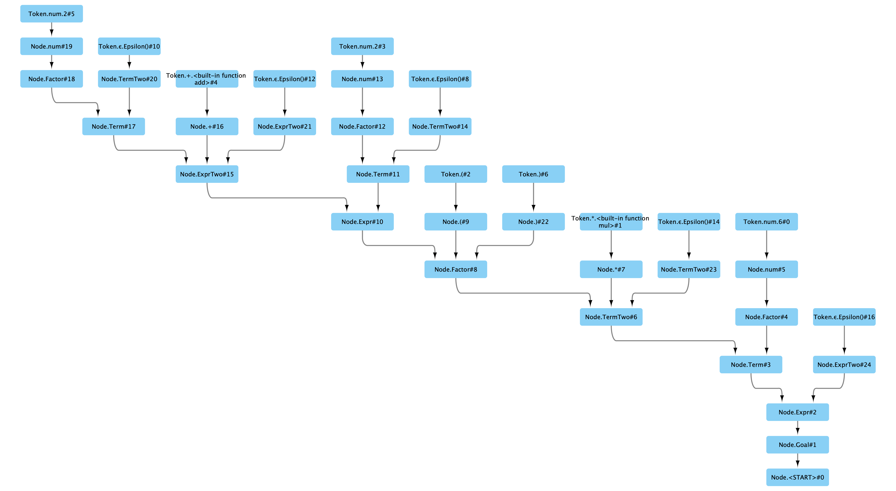

# 演示项目：算术计算器
## 流程
### Grammar 文件编写
本项目采用一种简化的 BNF 格式来表示语法规则。用户需要按照自己的语言的规则和编译器的限制（LL(1) 语法限制等），编写自己的语法规则文件。

本例中，需要实现的是一个算术计算器，语法文件位于 `calculator.mbnf`

### BNF 编译
本项目需要对使用 MBNF （.mbnf）格式进行解析，并按照 LL(1) 解析器生成包含 `FirstSet`、`FollowSet` 和 `Lookahead` 等信息的编译器辅助文件。

本例中，执行 `ll1_grammer_generator.py` 脚本则可以读入 `calculator.mbnf` 文件，进行 LL(1) 语法检查并生成编译器辅助文件 `calculator.yaml`。

### 构建自定义解析器
编译器只能构建执行流程，具体的业务逻辑，需要用户按照语法规则构建一系列语法单元解析函数，完成具体的业务功能。

本例中，使用了基于后缀表达式（逆波兰表达式）来表示计算的中间结果。具体见文件 `user_level_parser.py`

### 执行解释器
在编译器辅助信息（存储在 `calculator.yaml` 文件中）的帮助下，编译器会按照拓扑排序的方法依次执行用户解析器中的方法。用户的解析器负责最终生成一个基于后缀表达式（逆波兰表达式）的中间结果。
最后这个后缀表达式将会在 `MicroCompiler/postfix_expression/evaluator.py` 中得到执行，输出最终结果。

## 运行演示程序
在本目录里执行 `python ./main.py` 就可以执行演示程序。演示程序将演示如何计算 `6 * (2 + 2)` 的值。

## 抽象语法树
为了更好的展示语法的执行过程，本例提供了一个由程序（`python ./main.py`）自动生成的图文件: `calculator.graphml`, 该文件可以利用 `Cytoscape` 等图处理程序打开，并观察其中的依赖关系。

本例中计算 `6 * (2 + 2)` 的值过程可以通过一下抽象语法树表达：

## 代码测试
执行 `python ./tests.py` 就可以运行测试案例。具体的测试案例请查看文件 `test_cases.py`.